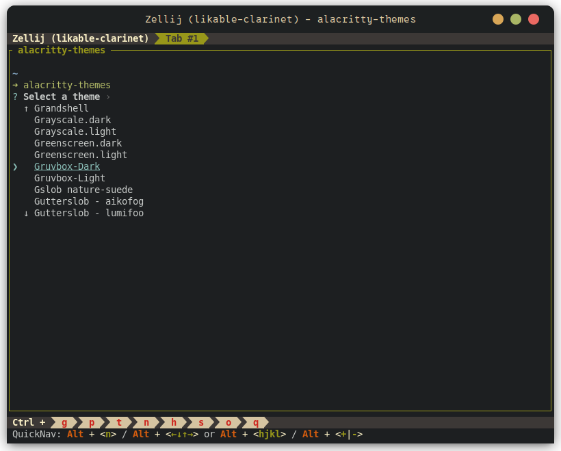
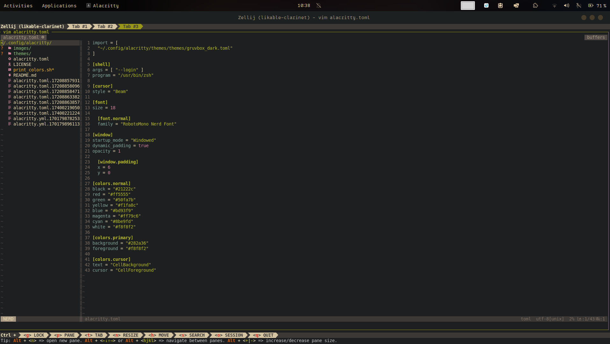

#### Install

Install dependencies:

```bash
apt install cmake g++ pkg-config libfreetype6-dev libfontconfig1-dev libxcb-xfixes0-dev libxkbcommon-dev python3 -y
```

Clone, compile and install:

```bash
git clone https://github.com/jwilm/alacritty
cd alacritty
cargo build --release
```

#### Customization

```bash
sudo mkdir /$HOME/.config/alacritty
```

```bash
vim /$HOME/.config/alacritty/alacritty.toml
```

Add theme:

```rs
import = [
  "~/.config/alacritty/themes/themes/gruvbox_dark.toml"
]
```

Or select default theme by using `alacritty-theme` command:



Set default shell:

```rs
[shell]
args = ['--login']
program = "/usr/bin/zsh"
```

Configure cursor, font size, font scheme and window size:

```rs
[cursor]
style = "Beam"

[font]
size = 16.0

[font.normal]
family = "RobotoMono Nerd Font"

[window]
startup_mode = "Windowed"
dynamic_padding = true
opacity = 1.0

[window.padding]
x = 6
y = 0
```

Color scheme:

```rs
[colors.normal]
black = "#21222c"
red = "#ff5555"
green = "#50fa7b"
yellow = "#f1fa8c"
blue = "#bd93f9"
magenta = "#ff79c6"
cyan = "#8be9fd"
white = "#f8f8f2"

[colors.primary]
background = "#282a36"
foreground = "#f8f8f2"

[colors.cursor]
text = "CellBackground"
cursor = "CellForeground"
```

Full config:

```rs
import = [
  "~/.config/alacritty/themes/themes/gruvbox_dark.toml"
]

[shell]
args = ['--login']
program = "/usr/bin/zsh"

[cursor]
style = "Beam"

[font]
size = 16.0

[font.normal]
family = "RobotoMono Nerd Font"

[window]
startup_mode = "Windowed"
dynamic_padding = true
opacity = 1.0

[window.padding]
x = 6
y = 0

[colors.normal]
black = "#21222c"
red = "#ff5555"
green = "#50fa7b"
yellow = "#f1fa8c"
blue = "#bd93f9"
magenta = "#ff79c6"
cyan = "#8be9fd"
white = "#f8f8f2"

[colors.primary]
background = "#282a36"
foreground = "#f8f8f2"

[colors.cursor]
text = "CellBackground"
cursor = "CellForeground"
```


