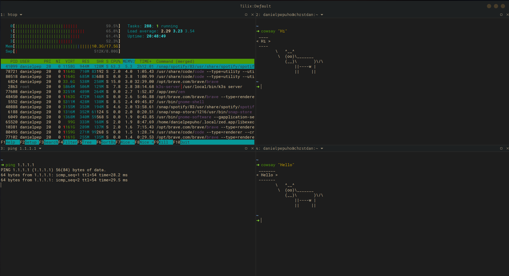
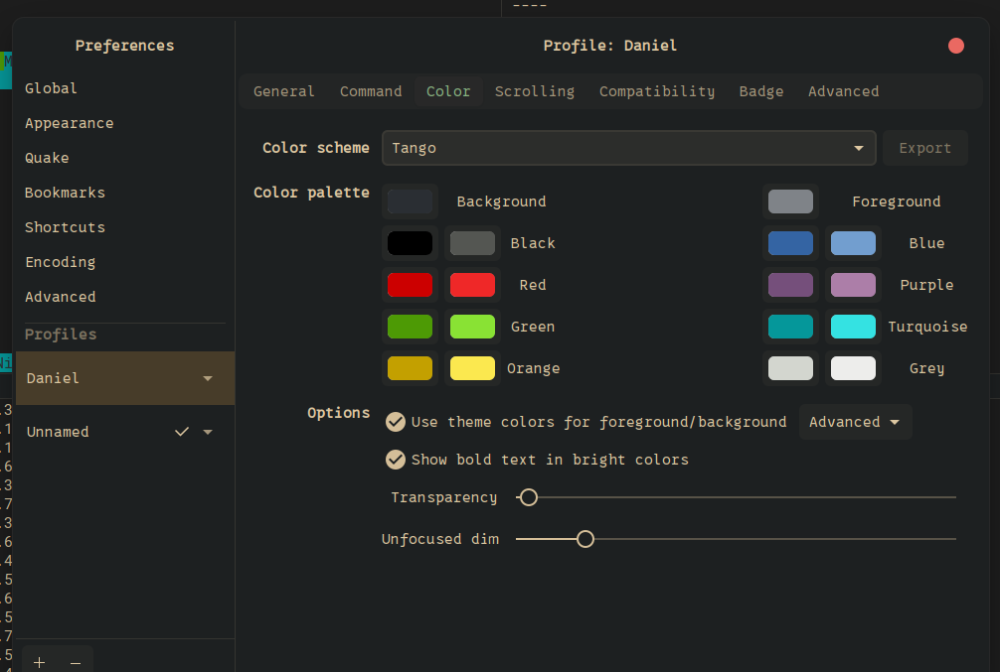
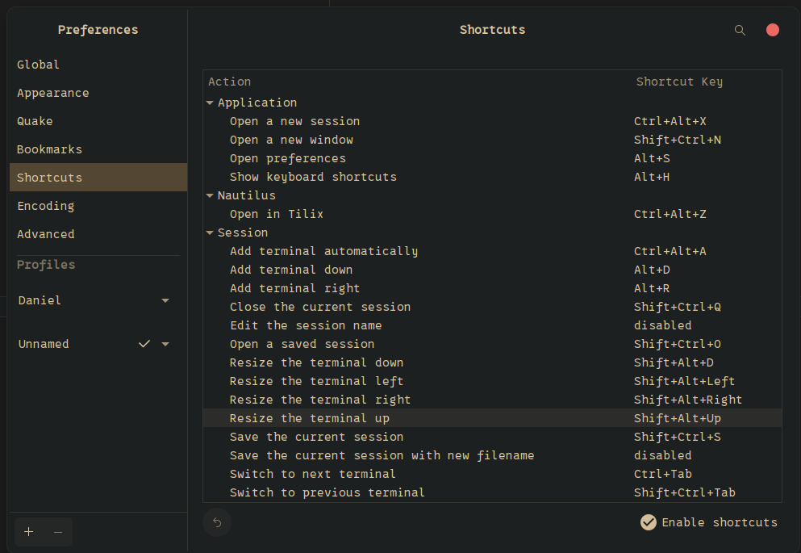

### Install

```bash
sudo apt install tilix -y
```

### Customization

True to its name, Tilix lets you run multiple terminal instances within the main window, a feature also available in the 'Terminator' terminal.



Add colorcheme by using `json` file and copy to `/usr/share/tilix/schemes/`

```json
{
    "name": "Tango",
    "comment": "Taken from Gnome Terminal",
    "use-theme-colors": true,
    "palette": [
        "#000000",
        "#CC0000",
        "#4D9A05",
        "#C3A000",
        "#3464A3",
        "#754F7B",
        "#05979A",
        "#D3D6CF",
        "#545652",
        "#EF2828",
        "#89E234",
        "#FBE84F",
        "#729ECF",
        "#AC7EA8",
        "#34E2E2",
        "#EDEDEB"
    ]
}
```



Shortcuts can be customized to fit your needs.


