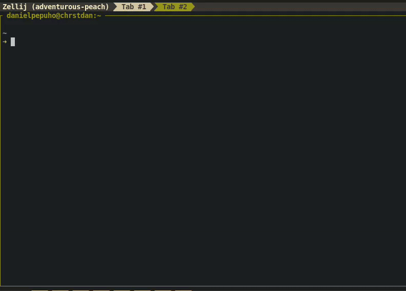

### Install

```bash
sudo apt install zsh -y
```

```bash
sh -c "$(wget https://raw.github.com/ohmyzsh/ohmyzsh/master/tools/install.sh -O -)"
```

Set zsh as default shell:

```bash
chsh -s $(which zsh)
```


### Customization

Add theme:

```bash
vim ~/.zshrc
```

```bash
ZSH_THEME="amuse"
```

Enables automatic command correction in Zsh. When set to true, Zsh will suggest corrections for mistyped commands and prompt:

```bash
ENABLE_CORRECTION="true"
```

Formats the timestamp for each command in the history using the specified date format:

```bash
HIST_STAMPS="mm/dd/yyyy"
```

Add plugins. Enables specified plugins to enhance Zsh functionality, such as Git integration, syntax highlighting, and command autosuggestions:

```bash
plugins=(
  git
  zsh-syntax-highlighting
  zsh-autosuggestions

)
```

Defines custom aliases for Git, Python, Tmux, Docker, system commands to simplify and speed up terminal usage, etc:

```bash
# Git Alias
alias ga="git add"
alias gcm="git commit"
alias gp="git push"
alias gcl="git clone"
alias gpl="git pull"
alias gbr="git branch"
alias gck="git checkout"

# Python Alias
alias py="python3"

# Tmux Alias
alias tx="tmux"
alias txn="tmux new -s"
alias txkl="tmux kill-session -t"

# Docker Alias
alias dcd="docker compose down"
alias dcu="docker compose up --build -d"

# System Alias
alias pwf="poweroff"
alias rbt="reboot"
```

Full configuration:

```sh
# If you come from bash you might have to change your $PATH.
# export PATH=$HOME/bin:/usr/local/bin:$PATH

# Path to your oh-my-zsh installation.
export ZSH=~/.oh-my-zsh

# Set name of the theme to load. Optionally, if you set this to "random"
# it'll load a random theme each time that oh-my-zsh is loaded.
# See https://github.com/robbyrussell/oh-my-zsh/wiki/Themes
ZSH_THEME="amuse"

#zplug "dracula/zsh", as:theme
# Set list of themes to load
# Setting this variable when ZSH_THEME=random
# cause zsh load theme from this variable instead of
# looking in ~/.oh-my-zsh/themes/
# An empty array have no effect
# ZSH_THEME_RANDOM_CANDIDATES=( "robbyrussell" "agnoster" )

# Uncomment the following line to use case-sensitive completion.
#CASE_SENSITIVE="true"

# Uncomment the following line to use hyphen-insensitive completion. Case
# sensitive completion must be off. _ and - will be interchangeable.
# HYPHEN_INSENSITIVE="true"

# Uncomment the following line to disable bi-weekly auto-update checks.
# DISABLE_AUTO_UPDATE="true"

# Uncomment the following line to change how often to auto-update (in days).
# export UPDATE_ZSH_DAYS=13

# Uncomment the following line to disable colors in ls.
# DISABLE_LS_COLORS="true"

# Uncomment the following line to disable auto-setting terminal title.
# DISABLE_AUTO_TITLE="true"

# Uncomment the following line to enable command auto-correction.
ENABLE_CORRECTION="true"

# Uncomment the following line to display red dots whilst waiting for completion.
# COMPLETION_WAITING_DOTS="true"

# Uncomment the following line if you want to disable marking untracked files
# under VCS as dirty. This makes repository status check for large repositories
# much, much faster.
# DISABLE_UNTRACKED_FILES_DIRTY="true"

# Uncomment the following line if you want to change the command execution time
# stamp shown in the history command output.
# The optional three formats: "mm/dd/yyyy"|"dd.mm.yyyy"|"yyyy-mm-dd"
HIST_STAMPS="mm/dd/yyyy"

# Would you like to use another custom folder than $ZSH/custom?
# ZSH_CUSTOM=/path/to/new-custom-folder

# Which plugins would you like to load? (plugins can be found in ~/.oh-my-zsh/plugins/*)
# Custom plugins may be added to ~/.oh-my-zsh/custom/plugins/
# Example format: plugins=(rails git textmate ruby lighthouse)
# Add wisely, as too many plugins slow down shell startup.
plugins=(
  git
  zsh-syntax-highlighting
  zsh-autosuggestions

)

#zplug "greymd/docker-zsh-completion"
source $ZSH/oh-my-zsh.sh

# Nord dircolor
test -r ~/.dir_colors && eval $(dircolors ~/.dir_colors)

# Git Alias
alias ga="git add"
alias gcm="git commit"
alias gp="git push"
alias gcl="git clone"
alias gpl="git pull"
alias gbr="git branch"
alias gck="git checkout"

# Python Alias
alias py="python3"

# Tmux Alias
alias tx="tmux"
alias txn="tmux new -s"
alias txkl="tmux kill-session -t"

# Docker Alias
alias dcd="docker compose down"
alias dcu="docker compose up --build -d"

# System Alias
alias pwf="poweroff"
alias rbt="reboot"
```


